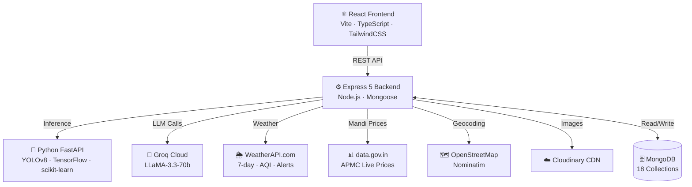
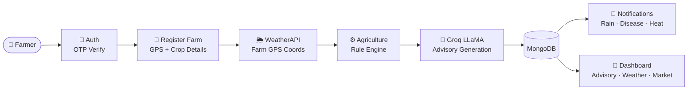
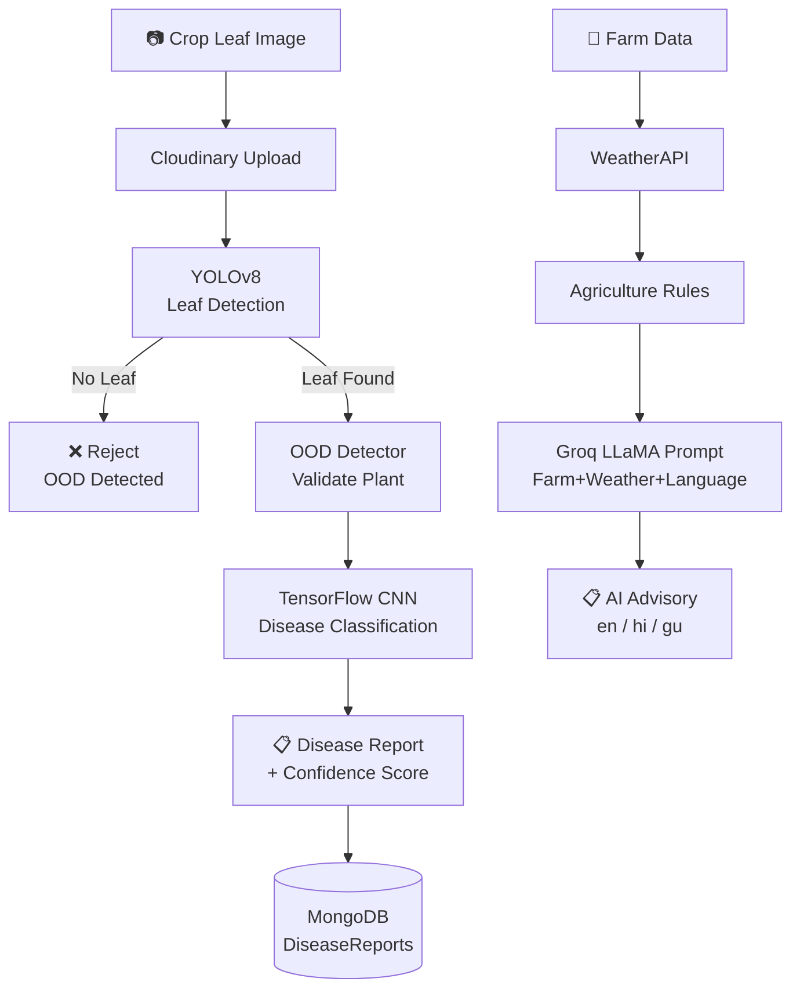

<div align="center">


<br/>

<a href="https://skillicons.dev">
  
</a>

<br/><br/>

[](./LICENSE)&nbsp;
[](https://groq.com)&nbsp;
[](https://weatherapi.com)&nbsp;
[](https://ultralytics.com)&nbsp;
[](#-multi-language-support)&nbsp;
[](https://github.com)

</div>

---

## 🌱 Overview

> **140 million Indian farmers** lose 30–40% of yield annually due to weather uncertainty, undetected crop diseases, and market ignorance.

**KrishiMitra AI** solves this with a single platform: real-time weather intelligence + Groq LLaMA-powered crop advisory + YOLOv8 disease detection + live APMC market prices — all in **English, Hindi & Gujarati**.

---

## ✨ Features

| Module | Capability |
|--------|-----------|
| 🔐 **Authentication** | Email + OTP signup, JWT dual-token, forgot/reset password |
| 🏡 **Farm Management** | Multi-farm, GPS capture, reverse geocoding, active farm switching |
| 🌦️ **Weather Intelligence** | 7-day forecast, AQI, hourly/daily data, agriculture rule engine |
| 🤖 **AI Crop Advisory** | Groq LLaMA-3.3-70b, growth-stage-aware, multi-language output |
| 💧 **Smart Irrigation** | Crop-specific water demand engine, 12 crop types supported |
| 🐛 **Disease Detection** | YOLOv8 → OOD Detector → TensorFlow CNN pipeline |
| 💹 **Market Intelligence** | Live APMC prices from data.gov.in, background cron sync |
| 🔮 **Sell/Store AI** | LLaMA-powered decision: STORE / SELL_NOW / SELL_PARTIALLY |
| 💬 **AI Chatbot** | Context-aware Groq chat with farm + weather injection |
| 🔔 **Notifications** | Telemetry-driven alerts: rain, disease, heat, irrigation, market |
| 🗺️ **Interactive Maps** | React-Leaflet farm location picker + OpenStreetMap geocoding |
| 🌐 **Multi-language** | English 🇬🇧 · Hindi 🇮🇳 · Gujarati 🇮🇳 — full stack i18n |
| 📊 **Reports** | PDF export via jsPDF + jspdf-autotable |
| 🏛️ **Gov Schemes** | Curated government agricultural scheme browser |

---

## 🏗️ System Architecture



---

## 🔄 Data Flow



---

## 🤖 AI Pipeline



---

## 🛠️ Tech Stack

**Frontend**


**Backend**


**AI / ML**


---

## ⚡ Quick Start

> **Requires:** Node.js 18+, Python 3.10+, MongoDB 6+

### 1. Clone

```bash
git clone https://github.com/CodeTitans/KrishiMitra-AI.git
cd KrishiMitra-AI
```

### 2. Backend

```bash
cd backend
npm install
cp .env.example .env      # Fill in your API keys
npm run dev               # → http://localhost:5000
```

### 3. Frontend

```bash
cd frontend
npm install
npm run dev               # → http://localhost:5173
```

### 4. Python AI Service

```bash
cd python-ai
pip install -r requirements.txt
uvicorn main:app --host 0.0.0.0 --port 8000 --reload   # → http://localhost:8000
```

### 5. Verify

| Service | URL | Expected |
|---------|-----|---------|
| Backend | `http://localhost:5000/` | `{"status": "Running"}` |
| Python AI | `http://localhost:8000/` | `{"modelLoaded": true}` |
| AI Docs | `http://localhost:8000/docs` | FastAPI Swagger UI |
| Frontend | `http://localhost:5173/` | Landing page |

---

## 🌍 Environment Variables

Create `backend/.env` from `backend/.env.example`:

| Variable | Description | Required |
|----------|-------------|:--------:|
| `PORT` | Backend port (default: 5000) | ✅ |
| `MONGO_URI` | MongoDB connection string | ✅ |
| `JWT_SECRET` | Access token signing secret | ✅ |
| `JWT_REFRESH_SECRET` | Refresh token signing secret | ✅ |
| `SMTP_HOST` | SMTP host (`smtp.gmail.com`) | ✅ |
| `SMTP_PORT` | SMTP port (`587`) | ✅ |
| `SMTP_USERNAME` | Gmail address | ✅ |
| `SMTP_PASSWORD` | Gmail App Password | ✅ |
| `FROM_EMAIL` | Sender email | ✅ |
| `GROQ_API_KEY` | Groq Cloud API key | ✅ |
| `WEATHERAPI_KEY` | WeatherAPI.com key | ✅ |
| `CLOUDINARY_CLOUD_NAME` | Cloudinary cloud name | ✅ |
| `CLOUDINARY_API_KEY` | Cloudinary API key | ✅ |
| `CLOUDINARY_API_SECRET` | Cloudinary secret | ✅ |
| `MANDI_API_KEY` | data.gov.in APMC key | ⚠️ |
| `PYTHON_AI_URL` | FastAPI URL (default: `http://localhost:8000`) | ⚠️ |

---

## 🔌 API Modules

| Module | Base Route | Key Endpoints |
|--------|-----------|---------------|
| **Auth** | `/auth` | `POST /signup` · `/verify-otp` · `/login` · `/refresh` · `/logout` |
| **Farm** | `/farms` | `POST /` · `GET /` · `GET /check` · `PATCH /:id/select` |
| **Weather** | `/weather` | `GET /` · `/dashboard` · `/forecast` · `/debug` |
| **Advisory** | `/advisory` | `GET /` · `POST /refresh` · `GET /history` |
| **Irrigation** | `/irrigation` | `GET /` · `POST /refresh` · `GET /history` |
| **Disease** | `/api/disease` | `POST /predict` · `GET /history` · `DELETE /history/all` |
| **Market** | `/market` | `GET /prices` · `/history` · `/nearby` · `POST /sync` |
| **Recommendation** | `/recommendation` | `POST /generate` · `GET /history` |
| **Price Prediction** | `/price-prediction` | `POST /` · `GET /history` |
| **Chat** | `/chat` | `POST /` · `GET /history` · `DELETE /history` |
| **Notifications** | `/notifications` | `GET /` · `POST /read` · `/read-all` · `DELETE /` |
| **Upload** | `/api/upload` | `POST /image` · `DELETE /:publicId` |
| **Location** | `/location` | `POST /reverse` · `GET /search` |

---

## 🗄️ Database Collections

| Collection | Purpose |
|------------|---------|
| `users` | Farmer accounts, roles, language preference |
| `farms` | Farm details with GeoJSON 2dsphere index |
| `advisories` | AI-generated crop advisories per farm |
| `weathercaches` | WeatherAPI response cache with TTL |
| `chathistories` | AI chatbot conversation sessions |
| `diseasereports` | Disease detection results + Cloudinary images |
| `notifications` | Telemetry-driven farm alerts |
| `marketprices` | Live APMC mandi prices from data.gov.in |
| `markettrends` | Price trend direction analysis |
| `pricepredictions` | Random Forest price forecast results |
| `recommendations` | Groq AI sell/store decisions |
| `irrigationcaches` | Computed irrigation plans per farm |
| `uploads` | Cloudinary upload records |

---

## 📦 Data Storage Map

| Resource | Location |
|----------|---------|
| User accounts | `users` collection |
| Farm data + GPS | `farms` collection (GeoJSON) |
| Weather responses | `weathercaches` collection |
| AI advisories | `advisories` collection |
| Chat sessions | `chathistories` collection |
| Disease reports | `diseasereports` collection |
| Mandi prices | `marketprices` collection |
| Irrigation plans | `irrigationcaches` collection |
| Uploaded images | Cloudinary CDN |
| Server logs | `backend/logs/` (Winston) |
| Secrets | `backend/.env` |

---

## 🌐 Multi-Language Support

Full i18n across frontend and backend:

| Language | Code | Coverage |
|----------|------|---------|
| 🇬🇧 English | `en` | Default — all UI + AI output |
| 🇮🇳 Hindi | `hi` | All UI + AI advisory + notifications |
| 🇮🇳 Gujarati | `gu` | All UI + AI advisory + notifications |

Language is persisted per user in MongoDB and `localStorage`. All Groq AI responses are generated in the user's chosen language via explicit prompt instruction.

---

## 🔒 Security

| Measure | Implementation |
|---------|----------------|
| HTTP Security Headers | `helmet` middleware |
| Authentication | JWT access + refresh token dual strategy |
| Password Storage | `bcrypt` with salt rounds = 10 |
| Email Verification | Time-limited OTP via Nodemailer |
| Input Validation | `express-validator` on auth + farm routes |
| File Uploads | Multer type/size validation |
| Secrets | All keys in `.env`, excluded from git |

---

## 🚀 Future Improvements

- 🌐 Additional Indian language support (Tamil, Telugu, Marathi)
- 📱 React Native mobile app
- 🌱 Soil health analysis module
- 🔇 Offline PWA with service worker caching
- 🤝 WhatsApp bot integration for rural farmers
- 📡 IoT soil sensor data ingestion pipeline

---

## 📈 Project Status

```
Authentication    ████████████████████  100%
Weather Engine   ████████████████████  100%
AI Advisory      ████████████████████  100%
Disease AI       ████████████████████  100%
Irrigation       ████████████████████  100%
Market Intel     ████████████████████  100%
AI Chatbot       ████████████████████  100%
Notifications    ████████████████████  100%
Multi-language   ████████████████████  100%
```

---

<div align="center">


**Built with ❤️ for India's Farmers · Team CodeTitans · MIT License**

[](https://github.com)
[](https://github.com)
[](./LICENSE)

</div>
