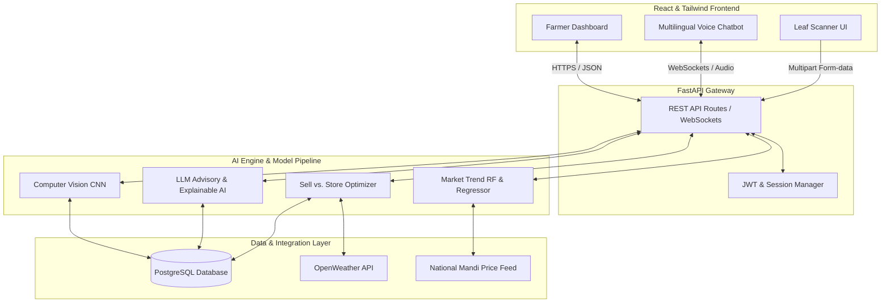
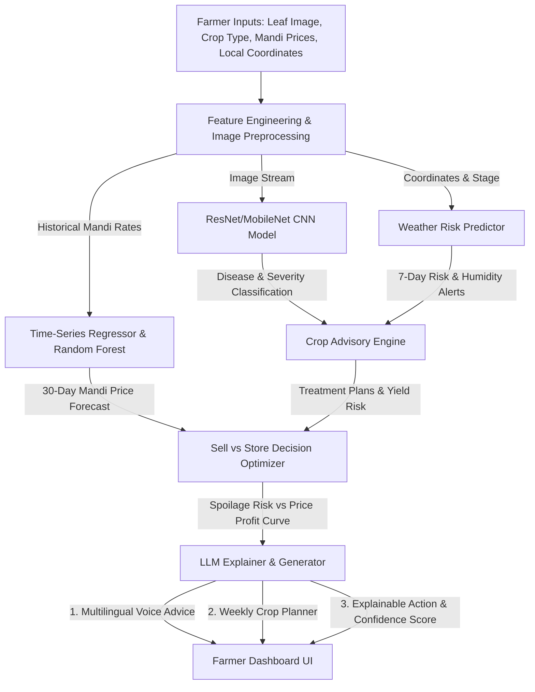

# 🌾 KrishiMitra AI — Next-Gen Agricultural Intelligence & Post-Harvest Decision Engine

---

## 📖 Project Overview

**KrishiMitra AI** is a state-of-the-art, AI-powered agricultural companion designed to bridge the gap between complex data science and everyday farming. By integrating real-time weather analytics, computer vision for crop disease detection, localized LLMs, and post-harvest market forecasting, KrishiMitra AI helps farmers mitigate risks, optimize resource consumption, and maximize their overall profitability.

Rather than providing generic advice, KrishiMitra AI acts as an end-to-end digital partner. It understands individual farm characteristics, monitors local weather deviations, and helps farmers make high-stakes financial decisions—such as whether to sell their harvest immediately or store it in cold storage to capture higher future prices.

---

## 🌾 The Reality of Indian Agriculture (The Problem)

### A Farmer's Story
> *"A small farmer in Gujarat often makes critical farming decisions based on intuition and historical habits rather than data. An unexpected heavy downpour, an unnoticed pest attack on a single leaf, or a sudden crash in the local Mandi price can wipe out months of capital and hard work. While modern AI has transformed many corporate sectors, personalized, actionable agricultural intelligence remains out of reach for millions of farmers."*

### Key Obstacles in Modern Farming:
* **Generic Recommendations:** Current agricultural apps offer blanket advice that fails to consider local soil composition, crop maturity stage, or micro-weather events.
* **Reactive Disease Control:** Pests and crop diseases are often identified too late, leading to massive crop losses or excessive, expensive pesticide use.
* **Post-Harvest Panic Selling:** Due to lack of pricing transparency and uncertainty about spoilage, farmers dump crops during peak harvest, causing localized oversupply and major price drops.
* **Language and Usability Barriers:** Complex agricultural data dashboards are unusable for standard farmers due to text-heavy layouts and lack of local language support.

---

## 🧠 System Architecture

KrishiMitra AI is designed with a modern, decoupled architecture. A highly interactive, responsive React frontend communicates with a high-performance FastAPI gateway, which handles orchestration between various ML model inference pipelines and third-party APIs.

---

## ⚙️ Machine Learning Pipeline

The internal ML Core processes farmer inputs and external telemetry streams in parallel to generate highly customized, confidence-scored recommendations.

### Deep Dive into ML Models:
1. **Computer Vision (CNN):** A deep convolutional neural network classifies leaf diseases (e.g., rust, blight, leaf-spot) from uploaded images, returning a classification label and severity percentage.
2. **Weather Risk Predictor:** Analyzes real-time and 7-day forecast data to flag crop disease vulnerabilities (high humidity flags pest risks) and suggest optimal harvest/irrigation times.
3. **Market Price Forecaster (Time-Series / Random Forest):** Predicts commodity prices across nearest local Mandis for the next 30 days based on volume, seasonality, and macro-trends.
4. **Heuristic Sell-Store-Transport Engine:** Synthesizes crop shelf-life (spoilage risk) and storage cost against Mandi price trends to calculate the mathematical inflection point: *Should the farmer sell now, transport to a high-paying market, or warehouse the crop?*
5. **Generative LLM (Llama / Mistral):** Takes structured data outputs from all ML engines and compiles them into a natural-sounding, localized dialect response explaining *why* the recommendations were made (Explainable AI).

---

## 🌟 Core Product Features

### 🚜 Precision Farming
* **AI Crop Advisory:** Personalized recommendations based on crop growth stages, current season, and soil properties.
* **Smart Irrigation Planner:** Recommends watering schedules based on soil moisture trends and incoming weather forecasts to conserve water.
* **Fertilizer Optimizer:** Suggests precise chemical/organic inputs depending on target yield and soil health cards.

### 🧠 AI Intelligence
* **Instant Disease Detection:** Fast upload analysis with actionable, localized treatment guides.
* **Mandi Market Forecasting:** Actionable 30-day forecast curves for regional crops.
* **Sell vs. Store Advisor:** Mathematical model maximizing farmer profit margin post-harvest.

### 🎙️ Farmer Assistance
* **Multilingual Voice Assistant:** Supports text-to-speech and voice commands in regional languages to support varying literacy levels.
* **Government Scheme Integration:** Matches active farm parameters with state and central agricultural subsidy databases.
* **Risk & Warning Alerts:** SMS/Voice broadcast notifications for upcoming weather anomalies or pest outbreaks.

---

## 💡 Unique Innovations (What Sets Us Apart)

* **Explainable AI (XAI) for Farmers:** Instead of delivering black-box predictions, KrishiMitra AI explains its reasoning (e.g., *"We recommend storing your wheat for 2 weeks because market volume is expected to fall by 20%, raising prices by 15%, which offsets the $0.05/kg cold storage cost"*).
* **AI Sell vs. Store Advisory:** Integrates spoilage risk estimation and storage log logistics into a profit-maximizing decision engine.
* **Dynamic Risk Scoring:** Continually calculates a unified farm vulnerability index (0-100) combining weather patterns, local pest activity reports, and irrigation levels.
* **Confidence-Ranked Recommendations:** Displays clear accuracy ranges for predictions, enabling risk-averse farmers to choose safer operational strategies.
* **Weekly Automated Crop Planner:** Generates a custom 7-day micro-task planner for the farmer based on historical crop records and current conditions.

---

## 📊 Expected Socio-Economic Impact

| Metric Area | Target Metric / Outcome | Impact Mechanism |
| :--- | :--- | :--- |
| **Water Usage** | 💧 **20-30% Reduction** | Evapotranspiration-based smart irrigation scheduler |
| **Crop Yield** | 🌾 **15-20% Increase** | Soil-targeted nutrient schedules & stage-based advisory |
| **Disease Mitigation** | 🐛 **Up to 40% Reduction** | Early-stage detection & localized remediation plans |
| **Post-Harvest Profits**| 💰 **20-25% Increase** | Smart Sell-vs-Store logic preventing panic-selling |
| **Decision Speed** | ⏱ **Real-time Answers** | Instant offline-cached mobile access to advice |

---

## 🏆 Competitive Advantage Matrix

| Feature | Generic Farming Apps | Local Mandi Agents | **KrishiMitra AI** |
| :--- | :---: | :---: | :---: |
| **Personalized Daily Advisory** | ❌ (Static articles) | ⚠️ (High bias) | **Yes (Data-Driven)** |
| **Automated Disease Detection** | ❌ | ❌ | **Yes (CV Scanner)** |
| **Forward Mandi Pricing Trends**| ❌ (Show today's price) | ⚠️ (Unreliable) | **Yes (30-Day Predictor)** |
| **Post-Harvest Store/Sell Decisions**| ❌ | ❌ | **Yes (Optimizer Engine)** |
| **Explainable AI Recommendations** | ❌ | ❌ | **Yes (LLM Explainer)** |
| **Multilingual Voice Assistant** | ❌ (Text only) | ⚠️ (Dialect only) | **Yes (Voice + Dialect)** |
| **Farm-Specific Risk Analysis** | ❌ | ❌ | **Yes (Unified Risk Score)** |

---

## 🔮 Future Scalability Roadmap

* **Satellite Telemetry:** Incorporating Sentinel-2 satellite imagery to monitor vegetation health (NDVI indices) across entire villages.
* **Drone Analytics Partnerships:** Integration with local drone sprayer services for targeted pest control based on CV disease heatmaps.
* **IoT Sensor Networks:** Real-time underground soil NPK, moisture, and pH sensors linked directly to the FastAPI telemetry agent.
* **Blockchain Crop Traceability:** Digitizing harvest records onto an immutable ledger to enable direct-to-buyer sales with certified organic validation.
