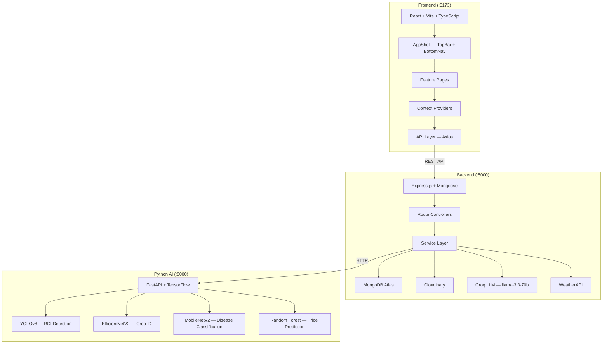
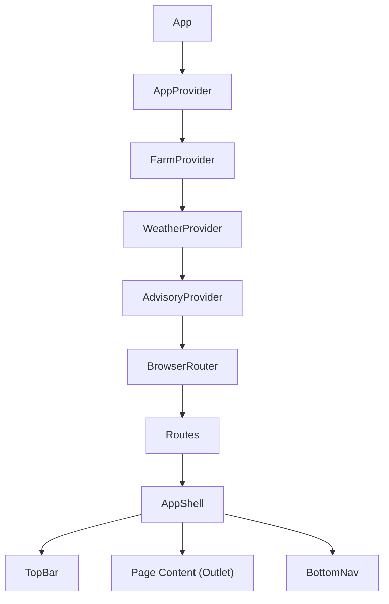

# KrishiMitra AI — System Architecture

## Overview

KrishiMitra AI is a 3-tier decoupled system designed for Indian smallholder farmers (age 30-65, low digital literacy, Android-first). It provides AI-powered crop disease detection, weather-based advisory, market intelligence, and irrigation guidance.

## Architecture Diagram



## Frontend Architecture

```
src/
├── app/                      # App entry, providers
│   └── App.tsx               # Routing + guards
├── components/
│   ├── ui/                   # Design system primitives (Button, Card, etc.)
│   ├── layout/               # AppShell, TopBar, BottomNav
│   ├── farm-status/          # FarmStatusHero widget
│   └── krishi-guide/         # Guided workflow (replaces chatbot)
├── features/
│   ├── home/                 # Dashboard — HomePage, ActionCard, Tasks, Alerts
│   ├── profile/              # ProfilePage — settings, reports, help
│   ├── auth/                 # Login, Signup, Onboarding
│   └── [feature]/            # Disease, Weather, Advisory, Market, etc.
├── context/                  # React Context providers (Farm, Weather, Advisory)
├── hooks/                    # Custom hooks (useGreeting, useFarmStatus)
├── api/                      # Axios API layer
├── i18n/                     # Translations (en, hi, gu)
├── design-system/            # Design tokens
├── lib/                      # Utilities (cn, constants)
└── types/                    # TypeScript types
```

## Component Hierarchy



## Data Flow

1. **User opens app** → `AppProvider` loads auth state from localStorage
2. **Auth check** → Fetches profile from `/api/auth/profile`, refreshes JWT if expired
3. **Farm check** → `FarmProvider` calls `/api/farms/check-status` to verify farm exists
4. **Weather + Advisory** → Context providers auto-fetch on `activeFarm` change
5. **HomePage** → Reads from all contexts, renders dynamic status cards + actions
6. **Feature pages** → Each page fetches its own data via API layer

## State Management

| State | Manager | Source |
|---|---|---|
| Auth (user, tokens) | `AppContext` | `/api/auth/` |
| Farm data | `FarmContext` | `/api/farms/` |
| Weather | `WeatherContext` | `/api/weather/dashboard` |
| Advisory | `AdvisoryContext` | `/api/advisory/` |
| UI (lang, theme) | `AppContext` | localStorage |

## API Layer

All API calls go through `src/api/` modules using Axios with:
- JWT bearer token in headers
- Auto token refresh on 401
- Language header (`Accept-Language`) for i18n responses
- Proxy via Vite dev server (`/api` → `localhost:5000`)

## Design Decisions

1. **Bottom Nav over Sidebar** — 85% mobile users, thumb zone optimization
2. **Context over Redux** — Simpler for the app's complexity level
3. **Feature-based folders** — Scalable, each feature is self-contained
4. **Earthy design** — High contrast for sunlight readability, trust-building colors
5. **i18n dictionary** — Single file for simplicity, supports en/hi/gu with fallback
