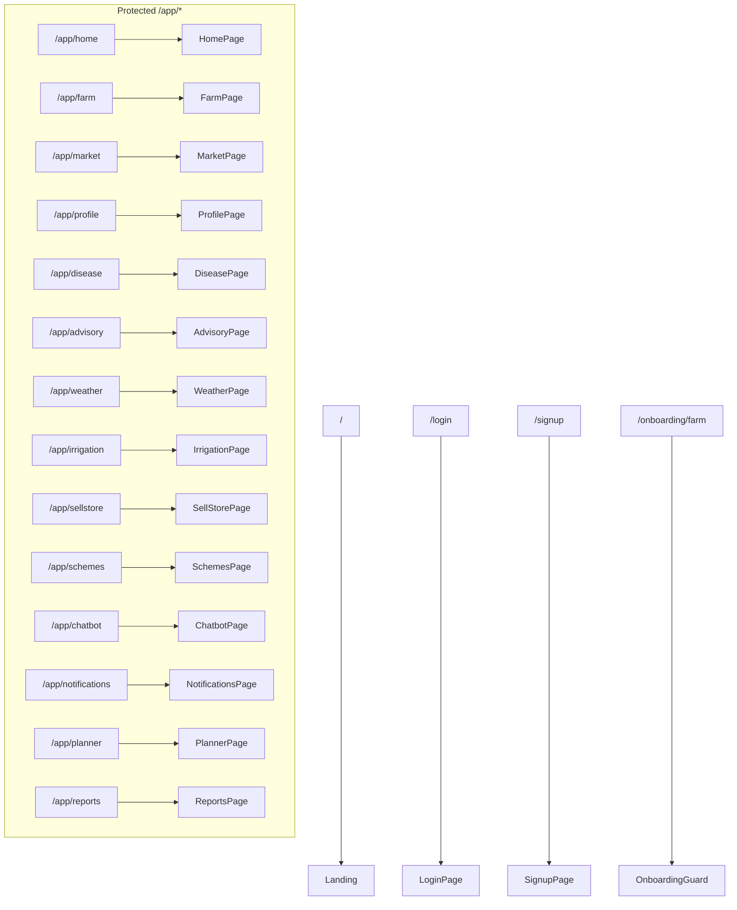

# Routing

## Route Map

## Guards

### ProtectedRoutes
- Checks `user` from `AppContext`
- If `loadingUser` → loading spinner
- If no user → redirect to `/login`
- Wraps content in `MandatoryFarmGuard`

### MandatoryFarmGuard
- Checks `hasFarm` from `FarmContext`
- If no farm → redirect to `/onboarding/farm`
- If has farm AND on onboarding → redirect to `/app/home`

## Backward Compatibility

- `/app/dashboard` → redirects to `/app/home`
- `/app` → redirects to `/app/home`

## Bottom Nav Tab Mapping

| Tab | Path | Active When |
|---|---|---|
| 🏠 Home | `/app/home` | `/app/home`, `/app/disease`, `/app/advisory`, `/app/weather`, `/app/irrigation`, `/app/schemes` |
| 🌾 My Farm | `/app/farm` | `/app/farm` |
| 📈 Market | `/app/market` | `/app/market`, `/app/sellstore` |
| 👤 Profile | `/app/profile` | `/app/profile` |
