# KrishiMitra AI — Complete Frontend System Overview & Technical Documentation

> **Version**: 1.0.0  
> **Role**: Senior Web Developer & Lead Frontend Architect Documentation  
> **Target Application**: KrishiMitra AI (Intelligent Farming Companion for Every Indian Field)  
> **Codebase Path**: `frontend/`

---

## 1. System Architecture & High-Level Overview

**KrishiMitra AI** is a state-of-the-art, web-based Progressive Web Application (PWA) tailored specifically for Indian farmers, agricultural extension officers, Krishi Sakhis, and agribusiness operators. The platform empowers users with real-time micro-climate weather forecasts, AI-based leaf crop disease diagnosis, growth-stage-tailored crop advisory, precision irrigation scheduling, live APMC mandi price tracking, financial sell-vs-store optimization algorithms, government scheme matchers, and a multilingual AI voice assistant.

### 1.1 Technical Stack Breakdown

| Layer | Technology / Library | Purpose & Rationale |
| :--- | :--- | :--- |
| **Core Framework** | React 18 + TypeScript + Vite | Ultra-fast build times, strict type safety, modular component architecture. |
| **Styling & Tokens** | Tailwind CSS v3 + CSS Variables | Utility-first CSS extended with custom color palettes, glassmorphic surfaces, and mesh gradients. |
| **Motion & Animation**| Framer Motion | Smooth component entry transitions, layout animations, interactive drag/hover micro-interactions. |
| **Icons** | Lucide React + Custom SVG Icons | High-clarity vector icons for agricultural tools, weather conditions, and navigation. |
| **Routing** | React Router v6 | Declarative client-side routing with nested protected layout (`AppLayout`) and public landing/auth routes. |
| **State & i18n** | React Context + LocalStorage | Centralized app state (`AppContext`) supporting persistent Theme, Language, User Session, and Farm Metadata. |
| **Speech Systems** | Web Speech API (SpeechRecognition + SpeechSynthesis) | Hands-free voice inputs and native speech narration in English, Hindi, and Gujarati. |

---

## 2. Design System, Color Palette, Styling & Backgrounds

The visual system of KrishiMitra AI is crafted around modern **Glassmorphism**, vibrant curated color tokens representing agriculture, and ambient background mesh gradients that adapt seamlessly between Light and Dark modes.

### 2.1 Color Palette Architecture

The design system incorporates three distinct semantic color domains defined in `tailwind.config.js`:

#### A. Brand Palette (Emerald Crop Green)
Represents crop vitality, plant health, growth, and sustainability.
* **`brand-50`**: `#f0fdf4` (Light background tints, subtle badges)
* **`brand-100`**: `#dcfce7`
* **`brand-200`**: `#bbf7d0`
* **`brand-300`**: `#86efac`
* **`brand-400`**: `#4ade80` (Dark mode accent highlights)
* **`brand-500`**: `#22c55e` (Primary Brand Color - indicators, success states)
* **`brand-600`**: `#16a34a` (Primary Action Buttons, interactive elements)
* **`brand-700`**: `#15803d` (Hover states, high-contrast text)
* **`brand-800`**: `#166534`
* **`brand-900`**: `#14532d`
* **`brand-950`**: `#052e16`

#### B. Soil Palette (Earth & Land Brown)
Represents soil health, farm land, field management, and organic farming.
* **`soil-50`**: `#faf6f0` | **`soil-100`**: `#f3e9d8` | **`soil-200`**: `#e6d2b0`
* **`soil-300`**: `#d4b27e` | **`soil-400`**: `#c08f4d` | **`soil-500`**: `#a87330`
* **`soil-600`**: `#8c5a25` | **`soil-700`**: `#6f4422` | **`soil-800`**: `#4a2d18` | **`soil-900`**: `#2e1b0f`

#### C. Sky & Water Palette (Atmosphere Blue)
Represents weather condition, precipitation, water management, and irrigation.
* **`sky-50`**: `#eff6ff` | **`sky-100`**: `#dbeafe` | **`sky-200`**: `#bfdbfe`
* **`sky-300`**: `#93c5fd` | **`sky-400`**: `#60a5fa` | **`sky-500`**: `#3b82f6`
* **`sky-600`**: `#2563eb` | **`sky-700`**: `#1d4ed8` | **`sky-800`**: `#1e40af` | **`sky-900`**: `#1e3a8a`

---

### 2.2 Backgrounds, Themes & Glassmorphism

#### Background Mesh Gradients
The application features dynamic fixed background mesh gradients that respond to the active theme:

```css
/* Light Mode Background Mesh */
radial-gradient(at 20% 20%, rgba(34,197,94,0.12) 0px, transparent 50%),
radial-gradient(at 80% 0%, rgba(59,130,246,0.10) 0px, transparent 50%),
radial-gradient(at 80% 100%, rgba(168,115,48,0.10) 0px, transparent 50%)

/* Dark Mode Background Mesh */
radial-gradient(at 20% 20%, rgba(34,197,94,0.15) 0px, transparent 50%),
radial-gradient(at 80% 0%, rgba(59,130,246,0.12) 0px, transparent 50%),
radial-gradient(at 80% 100%, rgba(168,115,48,0.08) 0px, transparent 50%)
```

#### Surface Elevation Utilities (`src/index.css`)
* **`.glass`**: Translucent container background with backdrop blur (`bg-white/70 dark:bg-slate-900/60 backdrop-blur-xl border border-white/40 dark:border-white/10`).
* **`.glass-strong`**: Enhanced backdrop density for dropdowns, popovers, and modals (`bg-white/85 dark:bg-slate-900/80 backdrop-blur-2xl border border-white/50 dark:border-white/10`).
* **`.card`**: Standard container component inheriting glass styling, 24px border radius (`rounded-3xl`), and custom elevation shadows (`shadow-card` / `dark:shadow-card-dark`).

---

### 2.3 Typography & Animation System

#### Fonts
* **Display Headings**: `Sora` (Google Fonts) — used for hero titles, section headings, and quantitative stats.
* **Body & UI Controls**: `Inter` (Google Fonts) — used for readable body text, inputs, data tables, and badges.

#### Motion Keyframes (`tailwind.config.js`)
* **`float`**: Smooth 6-second vertical floating animation for hero cards.
* **`shimmer`**: 1.5-second gradient sweep for content skeleton loaders.
* **`spin-slow`**: 8-second rotation for status rings and radar widgets.
* **`pulseRing`**: Radar pulse visualizer for live voice input recording.
* **`fadeIn`**: 0.6-second ease-out view container entrance animation.

---

## 3. Complete Page Inventory & Feature Guide

The frontend application consists of **15 distinct pages** divided into public marketing/auth views and protected application modules.

```mermaid
graph TD
    App[KrishiMitra AI Router] --> Public[Public Routes]
    App --> Protected[Protected App Routes /app]

    Public --> Landing[Landing Page /]
    Public --> Login[Login Page /login]
    Public --> Signup[Signup Page /signup]

    Protected --> Dashboard[Dashboard /app/dashboard]
    Protected --> Weather[Weather /app/weather]
    Protected --> Disease[Disease Scan /app/disease]
    Protected --> Advisory[Crop Advisory /app/advisory]
    Protected --> Irrigation[Irrigation /app/irrigation]
    Protected --> Market[Market Mandi /app/market]
    Protected --> SellStore[Sell vs Store /app/sellstore]
    Protected --> Schemes[Govt Schemes /app/schemes]
    Protected --> Chatbot[AI Chatbot /app/chatbot]
    Protected --> Notifications[Alerts /app/notifications]
    Protected --> Farm[My Farm /app/farm]
    Protected --> Planner[Crop Planner /app/planner]
    Protected --> Reports[Analytics & Reports /app/reports]
```



---

### Page Details & Feature Inventory

### 1. Landing Page (`/`)
* **Features**:
  * Fixed Glass Navigation Bar with Logo, Theme Switcher, Language Dropdown, and Auth CTA.
  * Parallax Hero Section with animated tagline, live interactive weather preview badge, CTA buttons ("Get Started", "Learn More"), and PWA Installation trigger ("Install App").
  * Core Feature Grid: Interactive showcase of all 8 core platform modules with custom iconography and color themes.
  * Live Impact Counter: Quantitative proof points (+28% Yield Increase, -23% Water Reduction, +₹42K Extra Income, 94% Disease Detection Accuracy).
  * Farmer Testimonial Carousel featuring testimonials from farmers across Gujarat, Karnataka, and UP.
  * Mobile App & PWA Download Section featuring QR codes and installation guidance.
  * Multi-column Footer with links, contact details, and copyright information.

### 2. Authentication Pages (`/login`, `/signup`)
* **Features**:
  * Glassmorphism Auth Card centered on screen with ambient backdrop.
  * User Role Selector: Switch between **Farmer**, **Krishi Sakhi**, **Agri Extension Officer**, and **Buyer**.
  * Input forms for Mobile Number / Email, Full Name, and Password.
  * Quick Demo Credentials Auto-Fill button for single-click evaluation.
  * Persistent authentication login state stored directly to `localStorage` via `AppContext`.

### 3. Dashboard (`/app/dashboard`)
* **Features**:
  * Personal Farmer Welcome Banner showing farmer name, location, and quick status badges.
  * Micro-Climate Weather Hero Widget displaying current temperature, weather condition icon, rain probability, humidity, and 7-day outlook.
  * Key Farm Metrics Bar: Crop Health Index (0–100), Soil Moisture Percentage, Next Irrigation Schedule countdown, and Live Commodity Price ticker.
  * High-Priority Advisory Alerts: Warnings for pest attacks or sudden rainfall.
  * Quick Action Launcher: One-click routing to Disease Scanner, Irrigation Planner, Market Mandi, and AI Assistant.
  * Recent Farm Activity Log & AI Farm Insights ticker.

### 4. Weather Forecast (`/app/weather`)
* **Features**:
  * Real-Time Micro-Climate Card: Temperature, Wind Speed (km/h), Relative Humidity (%), UV Index, and Air Quality Index (AQI).
  * Hourly Forecast Timeline Graph: Interactive temperature and precipitation trend over 24 hours.
  * 7-Day Weather Forecast: Daily high/low temperatures, weather state icons (`WeatherIcons.tsx`), and rainfall predictions.
  * Agricultural Spray Window Guidance: AI recommendation specifying optimal hours for pesticide/fertilizer spraying based on wind speed and humidity.
  * Weather Hazard Alerts: Extreme heatwave, frost, or torrential rain warnings with precautionary farming measures.

### 5. AI Disease Detection (`/app/disease`)
* **Features**:
  * Interactive Image Scanner: Drag-and-drop file uploader or direct device camera capture integration.
  * Live Target Box preview for accurate crop leaf positioning.
  * Instant AI Diagnosis Output:
    * Identified Disease Name (e.g., *Early Blight in Potato / Leaf Curl in Cotton*).
    * Diagnosis Confidence Percentage (e.g., *94% Confidence*).
    * Disease Severity Indicator (*Mild*, *Moderate*, *Critical*).
    * Symptoms Breakdown & Root Cause Analysis.
    * Treatment Protocol: Dual recommendations for **Organic Solutions** (e.g., Neem oil, Trichoderma) and **Chemical Treatments** with exact spray dosage per acre.
    * Preventive Action Plan for future crop cycles.
  * Historical Scan Logs: Previous crop scans with date stamps, disease tags, and resolution status.

### 6. Crop Advisory (`/app/advisory`)
* **Features**:
  * Multi-Crop Selector: Switch between major crops (*Wheat, Cotton, Paddy, Tomato, Sugarcane, Potato*).
  * Stage-Based Growth Roadmap: Interactive timeline covering *Sowing & Germination*, *Vegetative Phase*, *Flowering Stage*, *Fruiting/Grain Formation*, and *Harvesting*.
  * Stage-Specific Field Guidelines:
    * Fertilizer & NPK Dosage Calculator (Kg/Acre recommendations).
    * Pest & Disease Mitigation Protocol.
    * Soil Moisture and Weeding tips.
  * Audio Narration (Voice Advice): Integrated Web Speech API button allowing farmers to listen to advisory notes in English, Hindi, or Gujarati.

### 7. Irrigation Manager (`/app/irrigation`)
* **Features**:
  * Real-Time Soil Moisture Gauge: Circular visualizer representing current root-zone moisture (e.g., 38% - Optimal / Deficit).
  * AI Irrigation Scheduler: Calculated advice specifying exact water quantity (*e.g., "Apply 25mm water tomorrow at 06:00 AM"*).
  * Evapotranspiration (ET) Loss Estimator based on daily solar radiation and humidity.
  * Seasonal Water Conservation Metrics: Total liters of water saved and efficiency improvement percentage.
  * Water Source & Pump Log: Track drip/sprinkler run times and soil absorption rates.

### 8. Market Prices & Mandi (`/app/market`)
* **Features**:
  * APMC / Mandi Selector: Choose nearby markets (*e.g., Rajkot APMC, Surat APMC, Karnal Mandi*).
  * Commodity Price Table: Live listing of crops featuring Minimum Price, Maximum Price, Modal Price (₹/Quintal), and 24h Trend Percentage.
  * Distance & Travel Info for selected APMC yards.
  * 30-Day Commodity Price Graph: Visual trend curve helping farmers decide when price momentum is favorable.
  * Custom Price Alert Form: Set target price thresholds (e.g., *"Notify me when Wheat exceeds ₹2,450/q"*).

### 9. Sell vs Store Advisory (`/app/sellstore`)
* **Features**:
  * Financial Decision Calculator: Input fields for Crop Type, Harvest Quantity (Quintals), Current Market Price (₹/q), Monthly Storage Cost (₹/q), and Projected Price in 30/60 Days.
  * AI Financial Recommendation Card: Definitive guidance stating *"STORE FOR 45 DAYS"* or *"SELL IMMEDIATELY AT CURRENT MANDI RATE"*.
  * Net Profit Differential Matrix: Side-by-side comparative financial model calculating gross income, storage overhead, moisture shrinkage loss, and net profit margins.
  * Warehouse & Cold Storage Finder: List of licensed state/private warehouses with distance, available capacity, and monthly rates.

### 10. Government Schemes (`/app/schemes`)
* **Features**:
  * Comprehensive Subsidy & Scheme Catalog: PM-KISAN, PM Fasal Bima Yojana (PMFBY), Sub-Mission on Agricultural Mechanization (SMAM), Soil Health Card Scheme, Solar Pump Subsidy (KUSUM).
  * Scheme Detail Cards: Subsidy percentage (up to 80%), max financial benefit amount, eligibility criteria, and mandatory documents.
  * Smart Scheme Matcher: Filter schemes based on land holding size, farmer category (Small/Marginal/Large), state, and crop category.
  * Step-by-Step Application Checklist & Direct Portal Link Launcher.

### 11. Multilingual AI Chatbot (`/app/chatbot`)
* **Features**:
  * AI Conversational Companion tuned specifically for agricultural knowledge.
  * Multilingual Processing: Natural conversation handling in English, Hindi (हिन्दी), and Gujarati (ગુજરાતી).
  * Hands-Free Voice Controls: Micro-phone button for Speech-to-Text input and Audio speaker output for reading responses aloud.
  * Suggested Quick Prompts: One-tap action chips for common questions (*e.g., "Fertilizer for Cotton stage 2?", "Yellow leaves treatment?", "Wheat price trend?"*).
  * Farm Context Awareness: Automatically incorporates the farmer's active crop and location into answers.

### 12. Alerts & Notifications (`/app/notifications`)
* **Features**:
  * Centralized Notification Stream categorized into *Weather Hazards*, *Market Price Spikes*, *Pest Outbreaks*, and *Scheme Deadlines*.
  * Filter Tabs: View All, Unread, Critical, and Category specific feeds.
  * Unread Counter Badge integrated with topbar navigation.
  * Mark as Read / Mark All as Read management tools.

### 13. My Farm Registration (`/app/farm`)
* **Features**:
  * Farm Metadata Form: Farm Name, State, District, Village/Taluka, Land Area (Acres/Bighas), Soil Classification (*Black Cotton, Alluvial, Red, Sandy*), Primary Water Source (*Borewell, Canal, Drip, Rainfed*), and Current Crops.
  * Registered Farm Summary Card: Visual card displaying configured farm parameters used across the platform's AI calculation engines.
  * Farm Edit & Re-registration controls.

### 14. Seasonal Crop Planner (`/app/planner`)
* **Features**:
  * Agricultural Season Selector: Plan for **Kharif** (Monsoon), **Rabi** (Winter), or **Zaid** (Summer) crop cycles.
  * Activity Checklist Timeline: Month-by-month checklist for Land Prep, Sowing, First Irrigation, Basal Fertilization, Pest Monitoring, and Harvesting.
  * Input Budget Estimator: Itemized cost calculation for Seeds, Fertilizers, Micro-nutrients, Pesticides, Labor, and Machinery rental versus Projected Revenue.

### 15. Reports & Analytics (`/app/reports`)
* **Features**:
  * Season Performance Summary: Overall Crop Yield (Quintals), Total Season Revenue (₹), Total Expense (₹), and Net Profit Margin (%).
  * Visual Cost Breakdown: Donut chart and bar breakdowns of input costs (Fertilizer, Seed, Labor, Water, Tech).
  * Official Export System: One-click buttons to download printable PDF summaries and structured CSV files for bank loan applications and crop insurance validation.

---

## 4. Shared Components & Navigation Primitives

The core user interface is built using reusable design primitives located in `src/components/`:

```
src/components/
├── AppLayout.tsx           # Main app shell header, profile popover, outlet container
├── Sidebar.tsx             # Collapsible primary navigation drawer (13 app links)
├── Controls.tsx            # ThemeToggle & LanguageSwitcher components
├── FloatingAssistant.tsx   # Global Floating FAB with Voice, Scan, Emergency Hotline & AI Chat
├── WeatherIcons.tsx        # Vector SVG renderer for dynamic weather states
└── ui.tsx                  # Reusable UI Primitives (Card, Badge, StatCard, ProgressBar, etc.)
```

### Core Primitives (`ui.tsx`)
1. **`Card`**: Motion container inheriting `.card` glass class with optional hover elevation (`hover:-translate-y-1`).
2. **`Badge`**: Semantic badge tags supporting variants `success` (green), `warning` (amber), `error` (red), `info` (blue), and `neutral` (slate).
3. **`StatCard`**: High-impact metric display card featuring label, large display typography, optional trend indicator (up/down), and custom color gradients (`brand`, `sky`, `amber`, `soil`, `rose`).
4. **`ProgressBar`**: Animated motion progress bar for soil moisture, crop health, and completion steps.
5. **`FloatingAssistant`**: Persistent bottom-right floating action widget accessible on every protected route. Provides single-tap access to AI Voice command modal, instant disease camera scanner, emergency Kisan helpline number (`1551`), and chatbot launcher.

---

## 5. Internationalization (i18n) & Localization System

KrishiMitra AI supports native multilingual accessibility to ensure seamless adoption by farmers across regional language barriers.

### 5.1 Supported Languages (`src/i18n/dictionaries.ts`)

| Code | Label | Native Script | Coverage |
| :--- | :--- | :--- | :--- |
| **`en`** | English | English | 100% UI Keys & Prompts |
| **`hi`** | Hindi | हिन्दी | 100% UI Keys & Prompts |
| **`gu`** | Gujarati | ગુજરાતી | 100% UI Keys & Prompts |

### 5.2 Resolution Logic
Translations are retrieved via the `t(key: string)` function provided by `useApp()`:

$$\text{Translation}(key) = \text{dictionaries}[\text{lang}][key] \;\parallel\; \text{dictionaries}[\text{en}][key] \;\parallel\; key$$

Whenever language changes, `document.documentElement.lang` is dynamically updated to trigger proper native typography rendering for Devanagari and Gujarati scripts.

---

## 6. State Management & Storage Engine

Application state is managed globally through `AppContext.tsx` with zero external heavy state libraries, utilizing React hooks and persistent `localStorage` bindings.

```
LocalStorage Keys:
├── km_lang   => Active Language Code ('en' | 'hi' | 'gu')
├── km_theme  => Active Visual Theme ('light' | 'dark')
├── km_user   => User Session Object { name, email, role }
└── km_farm   => Farm Metadata Object { name, village, district, area, crop, soil, ... }
```

### Theme Synchronization
When `theme` changes to `'dark'`, the `'dark'` class is appended directly to `document.documentElement`. This triggers Tailwind CSS `dark:` variant classes across all components and switches the background mesh gradient from `mesh-light` to `mesh-dark`.

---

## 7. Summary Table of Frontend Routes

| Route | Component | Access | Key Features |
| :--- | :--- | :--- | :--- |
| `/` | `Landing.tsx` | Public | Hero, Live Stats, Feature Matrix, Impact Stats, Testimonials, PWA |
| `/login` | `Login.tsx` | Public | Glass Auth Card, Role Selector, Demo Auto-fill |
| `/signup` | `Signup.tsx` | Public | Registration Form, Role Selector |
| `/app/dashboard` | `Dashboard.tsx` | Protected | Farm Summary, Weather Hero, Metric Cards, Quick Actions |
| `/app/weather` | `Weather.tsx` | Protected | AQI, Wind, UV, Hourly Forecast, 7-Day Forecast, Spray Window |
| `/app/disease` | `DiseaseDetection.tsx` | Protected | Camera Upload, AI Diagnosis, Organic/Chemical Remedy, Scan History |
| `/app/advisory` | `Advisory.tsx` | Protected | Crop Stage Timeline, NPK Calculator, Voice Narration |
| `/app/irrigation` | `Irrigation.tsx` | Protected | Soil Moisture Meter, AI Water Advice, ET Loss, Water Savings Log |
| `/app/market` | `Market.tsx` | Protected | Mandi Selector, Commodity Prices, 30-Day Trend, Price Alert Form |
| `/app/sellstore` | `SellStore.tsx` | Protected | Sell vs Store Decision Engine, Net Profit Matrix, Warehouse Finder |
| `/app/schemes` | `Schemes.tsx` | Protected | Subsidy Catalog, Scheme Matcher, Document Checklist |
| `/app/chatbot` | `Chatbot.tsx` | Protected | Multilingual AI Chatbot, Voice Input/Output, Quick Prompts |
| `/app/notifications` | `Notifications.tsx` | Protected | Emergency Alerts Feed, Filters, Mark as Read Controls |
| `/app/farm` | `FarmRegistration.tsx` | Protected | Farm Location, Land Area, Soil Type, Water Source Form |
| `/app/planner` | `Planner.tsx` | Protected | Kharif/Rabi/Zaid Calendar, Activity Checklist, Input Cost Estimator |
| `/app/reports` | `Reports.tsx` | Protected | Season Financial Summary, Expense Charts, PDF/CSV Export |

---
*Documentation Generated & Validated for KrishiMitra AI Frontend Application.*
